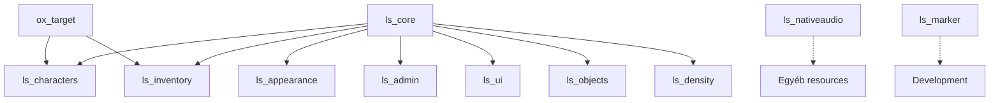

# Resources

Az LS Server **resource-jainak** dokumentációja. A resource-ok két fő kategóriába vannak szervezve:

## 📦 Core Resources

Az alapvető működéshez szükséges resource-ok:

- 🛡️ [ls_admin](/resources/core/ls_admin) - Admin eszközök és menü
- 👤 [ls_appearance](/resources/core/ls_appearance) - Karakter megjelenés szerkesztő
- 🎭 [ls_characters](/resources/core/ls_characters) - Karakter választó és kezelő
- 🎒 [ls_inventory](/resources/core/ls_inventory) - Inventory rendszer
- ⏳ [ls_loading](/resources/core/ls_loading) - Loading screen
- 🎯 [ls_objects](/resources/core/ls_objects) - Object kezelő rendszer
- 🎨 [ls_ui](/resources/core/ls_ui) - UI komponensek
- 🎪 [ls_density](/resources/core/ls_density) - NPC és jármű density kezelés
- 🎯 [ox_target](/resources/core/ox_target) - Target rendszer

## 🔧 Helper Resources

Kiegészítő és helper resource-ok:

- 🔊 [ls_nativeaudio](/resources/helpers/ls_nativeaudio) - Custom hang rendszer
- 📍 [ls_marker](/resources/helpers/ls_marker) - Marker készítő eszköz
- 🎵 [ls_audiotest](/resources/helpers/ls_audiotest) - Audio teszt eszköz

## Resource függőségek



## Quick Start

### Core resource-ok betöltése

```lua
-- server.cfg
ensure ls_core          # Először a core
ensure ox_target        # Target rendszer
ensure ls_characters    # Karakter rendszer
ensure ls_appearance    # Megjelenés
ensure ls_inventory     # Inventory
ensure ls_ui            # UI komponensek
ensure ls_admin         # Admin eszközök
ensure ls_loading       # Loading screen
ensure ls_objects       # Object kezelés
ensure ls_density       # Density kezelés
```

### Helper resource-ok

```lua
-- Opcionális helper-ek
ensure ls_nativeaudio   # Custom hangok
ensure ls_marker        # Marker eszköz (dev)
ensure ls_audiotest     # Audio teszt (dev)
```

## Resource kategóriák

### Játékos kezelés
- [ls_characters](/resources/core/ls_characters) - Karakter választó, létrehozás
- [ls_appearance](/resources/core/ls_appearance) - Megjelenés szerkesztés

### UI & UX
- [ls_ui](/resources/core/ls_ui) - Notifikációk, menük, progressbar
- [ls_loading](/resources/core/ls_loading) - Loading screen customizálás
- [ox_target](/resources/core/ox_target) - Interakció rendszer

### Játék mechanikák
- [ls_inventory](/resources/core/ls_inventory) - Item kezelés, tárolók
- [ls_objects](/resources/core/ls_objects) - Objektum spawn és kezelés
- [ls_density](/resources/core/ls_density) - Járműforgalom és NPC kezelés

### Admin & Dev
- [ls_admin](/resources/core/ls_admin) - Admin menü és eszközök
- [ls_marker](/resources/helpers/ls_marker) - Marker készítő tool
- [ls_audiotest](/resources/helpers/ls_audiotest) - Hang teszt

### Audio
- [ls_nativeaudio](/resources/helpers/ls_nativeaudio) - Custom hangok betöltése

## Következő lépések

Válassz egy resource-t a részletes dokumentációhoz, vagy kezdd az [ls_core](/core) alapjaival.

---

**Megjegyzés:** A resource-ok többsége függ az [ls_core](/core) framework-től. Győződj meg róla, hogy az ls_core megfelelően be van állítva!
